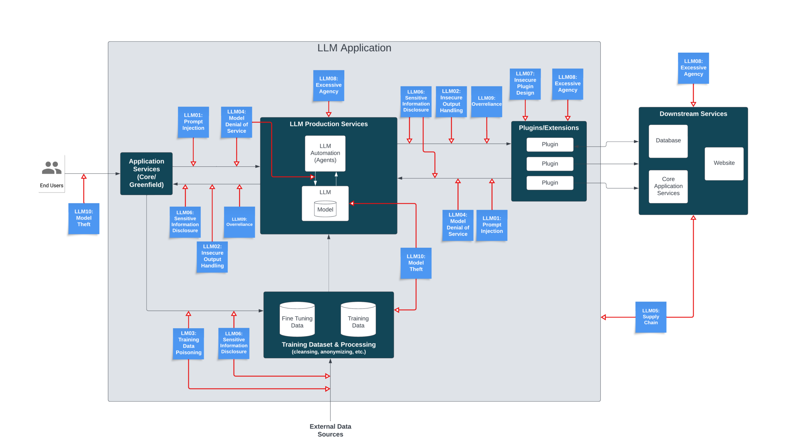

# OWASP-Top-10-LLM

## 1. LLM01: Prompt Injection

- Issue: Attackers manipulate LLM inputs to cause unintended actions.
- Identification: Look for unusual or harmful outputs after processing inputs.
- Mitigation:

    - Enforce privilege control on LLM access.
    - Add human verification for critical operations.
    - Segregate external content from user prompts.
    - Regularly monitor and audit LLM input and output.

## 2. LLM02: Insecure Output Handling

- Issue: Insufficient validation and handling of LLM outputs before passing them downstream.
- Identification: Check for unexpected behaviors like XSS, CSRF, or SSRF in applications using LLM outputs.
- Mitigation:

    - Apply input validation on LLM responses.
    - Follow OWASP ASVS guidelines for input validation and sanitization.
    - Encode model output back to users to prevent code execution.

## 3. LLM03: Training Data Poisoning

- Issue: Tampering with training data to introduce vulnerabilities or biases.
- Identification: Monitor training stages for anomalies and validate training data sources.
- Mitigation:

    - Verify the legitimacy of data sources.
    - Use data sanitization and adversarial robustness techniques.
    - Implement human-in-the-loop review processes.

## 4. LLM04: Model Denial of Service

- Issue: Attackers cause resource-heavy operations on LLMs leading to service degradation.
- Identification: Monitor for spikes in resource usage and performance degradation.
- Mitigation:

    - Implement rate limiting and resource allocation controls.
    - Use load balancing and scaling strategies.

## 5. LLM05: Supply Chain Vulnerabilities

- Issue: Vulnerabilities in third-party components or services used by LLMs.
- Identification: Conduct thorough security assessments of third-party components.
- Mitigation:

    - Regularly update and patch third-party components.
    - Use dependency tracking and verification tools.

## 6. LLM06: Sensitive Information Disclosure

- Issue: LLMs inadvertently reveal confidential data.
- Identification: Review LLM responses for unauthorized data access.
- Mitigation:

    - Implement data sanitization and strict user policies.
    - Use access controls and data anonymization techniques.

## 7. LLM07: Insecure Plugin Design

- Issue: Plugins with insecure inputs and insufficient access control.
- Identification: Test plugins for security vulnerabilities and access control issues.
- Mitigation:

    Follow OWASP ASVS guidelines for plugin design.
    - Use OAuth2 for effective authorization and access control.
    - Require manual user authorization for sensitive actions.

## 8. LLM08: Excessive Agency

- Issue: LLMs perform damaging actions due to excessive functionality, permissions, or autonomy.
- Identification: Monitor LLM actions and plugin usage for unexpected behaviors.
- Mitigation:

    - Limit plugin functionality and permissions to the minimum necessary.
    - Use human-in-the-loop control for high-impact actions.
    - Implement logging and monitoring to identify undesirable actions.

## 9. LLM09: Overreliance

- Issue: Overdependence on LLM outputs without oversight.
- Identification: Check for inaccurate or misleading information provided by LLMs.
- Mitigation:

    - Regularly review and validate LLM outputs.
    - Implement disclaimers and continuous validation mechanisms.

## 10. LLM10: Model Theft

- Issue: Unauthorized access, copying, or exfiltration of proprietary LLM models.
- Identification: Monitor access logs and activities related to LLM models.
- Mitigation:

    - Implement strong access controls and authentication mechanisms.
    - Restrict LLM access to network resources and APIs.
    - Use watermarking and adversarial robustness training.